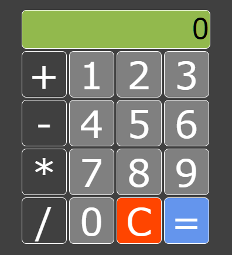

# Calculadora Básica en JavaScript
  

Una calculadora simple construida con HTML, CSS y JavaScript que permite realizar operaciones aritméticas básicas.

 <!-- Si tienes una imagen de preview, puedes incluirla -->

## Características

- Interfaz limpia y simple
- Operaciones básicas: suma, resta, multiplicación y división
- Botón para limpiar el display (C)
- Validación de división por cero
- Diseño moderno con grid CSS

## Tecnologías Utilizadas

- HTML5
- CSS3 (Grid Layout)
- JavaScript Vanilla

## Cómo Usar

1. Haz clic en los botones numéricos para ingresar números
2. Selecciona una operación (+, -, *, /)
3. Ingresa el segundo número
4. Presiona "=" para ver el resultado
5. Usa "C" para limpiar la calculadora

## Instalación

No se requiere instalación. Simplemente:

1. Clona el repositorio o descarga los archivos
   ```bash
   git clone https://github.com/tu-usuario/tu-repositorio.git
   ```
2. Abre el archivo `index.html` en tu navegador favorito

## Estructura del Proyecto

```
calculadora-basica/
├── index.html       # Archivo principal HTML
├── style.css        # Estilos CSS
└── index.js         # Lógica de la calculadora
```

## Funcionamiento Interno

La calculadora funciona con tres variables principales:
- `numero1`: Almacena el primer operando
- `numero2`: Almacena el segundo operando
- `operador`: Guarda la operación a realizar

La función `resolver()` se encarga de realizar los cálculos según el operador seleccionado.

